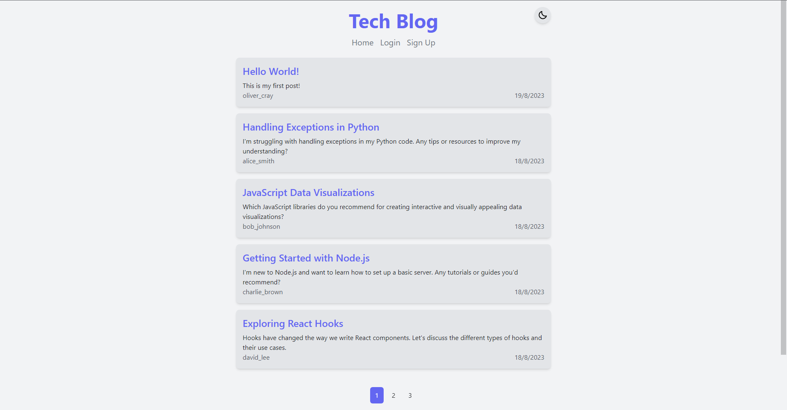
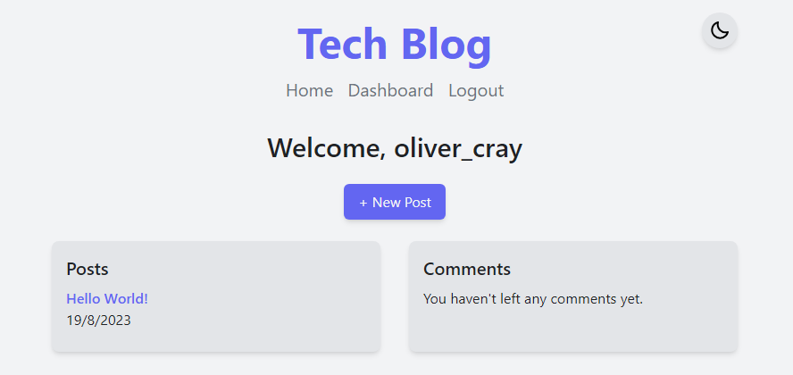
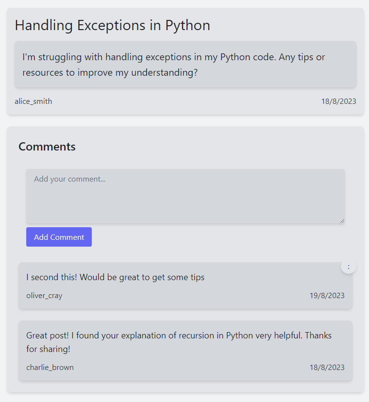
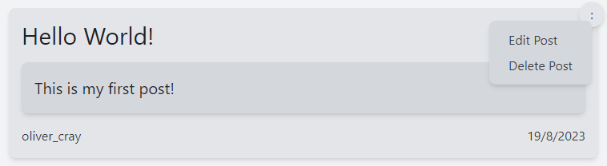
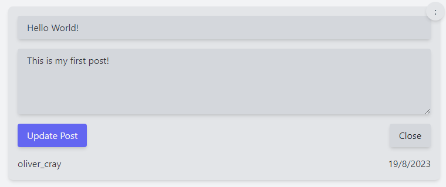
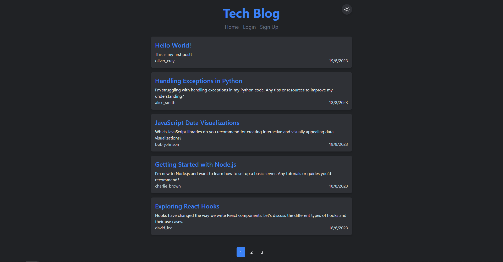

# MVC-Tech-Blog

## Purpose of Task

Creation of a CMS-style blog site where developers can publish their blog posts and comment on other developers' posts. This site is built from scratch and deployed to Heroku, using JawsDB to host the database. This application follows the MVC paradigm in its architectural structure, using Handlebars.js as the templating language, Sequelize as the ORM for interacting with a MySQL database, and the express-session npm package for authentication. Tailwind CSS is used for styling.

## Table of Contents

- [Description](#description)

- [Link](#link)

- [Usage](#usage)

- [Screenshot](#demonstration-video)

- [Credits](#credits)

## Description

This is a full-stack web application that allows users to create an account, log in, create blog posts, and comment on other users' posts. Users are also able to edit and delete their own posts and comments.

When the user first visits the site, they are presented with the homepage, which displays the five most recent posts. The user can use the pagination at the bottom of the screen to navigate to additional pages to view more posts. The user can click on the title of a post to view the post and its comments. If the user is logged in, they will see a form that they can use to add comments.

If the user clicks on the **Login** link in the navigation bar, they are taken to the login page, where they can enter their username and password. If the user does not have an account, they can click on the **Sign Up** link to be taken to the signup page, where they can create an account. Once the user is logged in, they will see a link to the dashboard in the nav bar. Clicking on this link will take the user to their dashboard, where they can view all of their posts and comments. Clicking on the **+ New Post** button will open a form where the user can enter a title and body for their post. After clicking the "Create Post" button, the dashboard reloads and the user can see their new post under the **Posts** section.

Upon visiting their new post, the user will see a button with a **:** icon, clicking this will open a context menu where the user can either edit or delete their post. Clicking on the **Edit Post** button will replace the post's title and body with a form containing input fields, allowing the user to edit their post. Clicking on the **Delete Post** button will delete the post and any associated comments from the database and redirect the user to their dashboard. This works similarly for comments. The user will only see the context menu next to their own posts and comments.

The user can log out by clicking on the **Logout** link in the navigation bar. This will destroy the session and redirect the user to the homepage.

The user can toggle between light and dark mode by clicking on the sun or moon icon at the top of the screen. The default is light mode.

## Link

The deployed site is available [here](https://peaceful-gorge-49930-91553d826a7d.herokuapp.com/)

## Usage

To run this application locally, first clone the repository and open it in your code editor. Open a new terminal and type the following command to install the required dependencies.

```sh
npm i
```

Rename the **.env.EXAMPLE** file to **.env** and input your details, these will be the same details you use to login to the MySQL shell.

```dosini
DB_NAME='tech_blog_db'
DB_USER=''
DB_PASSWORD=''
```

To create the database, first login to the MySQL shell by typing the following command in the terminal, enter your password when prompted. Replace **root** with your MySQL username if it is not root.

```sh
mysql -u root -p
```

You now need to create the database using the source command, after which you can exit the MySQL shell using the quit command.

```sh
source db/schema.sql
```

```sh
quit;
```

To seed the database, type the following command in the terminal.

```sh
npm run seed
```

To start the server, type the following command in the terminal.

```sh
npm start
```

To view the application, open your browser and navigate to http://localhost:3001.

If you wish to run the application in development mode, type the following command in the terminal instead. This will allow you to use nodemon to automatically restart the server whenever you make changes to the code as well as rebuilding the CSS file whenever you add or change Tailwind classes.

```sh
npm run dev
```

## Screenshot













## Credits

- [Boxicons](https://boxicons.com/)
  - Used for the sun and moon icons in the dark mode toggle button.
